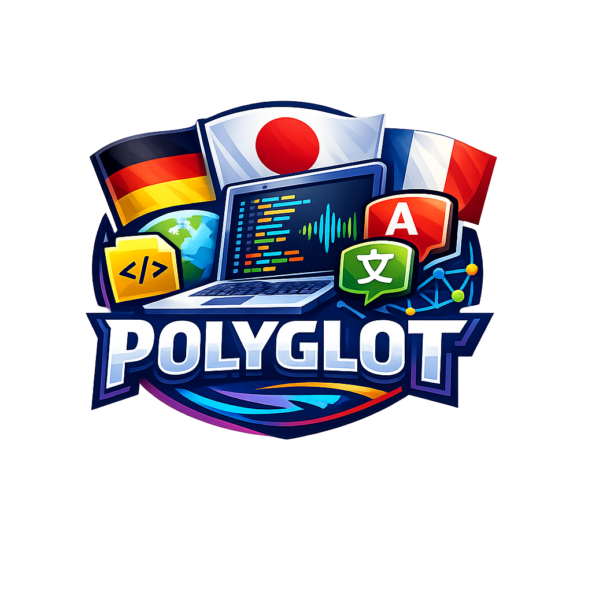

  <a href="README.ja.md">日本語</a> | <a href="README.zh.md">中文</a> | <a href="README.es.md">Español</a> | <a href="README.fr.md">Français</a> | <a href="README.hi.md">हिन्दी</a> | <a href="README.it.md">Italiano</a> | <a href="README.md">English</a>

  

<strong>Translate text, files, and READMEs directly in VS Code — powered by your local GPU. 55 languages, zero cloud dependency.</strong>

  
  
  
  
  

---

## O que ele faz

O Polyglot executa o [TranslateGemma 12B](https://ai.google.dev/gemma/docs/core/translategemma) através do [Ollama](https://ollama.com) na sua GPU local. Não requer chaves de API, serviços em nuvem ou envio de dados para fora do seu computador.

- **Traduzir Seleção** — Selecione o texto, pressione `Ctrl+Alt+T`, escolha um idioma. Pronto.
- **Traduzir Arquivo** — Traduz um arquivo inteiro para um novo arquivo `file.ja.ext` junto com o original.
- **Traduzir README** — Traduz em lote o seu arquivo README.md para 7 idiomas, preservando blocos de código, tabelas e badges.
- **Painel Lateral** — Ícone de globo na barra de atividades com botões de ação e status do Ollama em tempo real.

## Requisitos

- [Ollama](https://ollama.com) instalado e em execução
- Uma GPU com VRAM suficiente para o modelo (12GB para `translategemma:12b`, 2GB para `translategemma:2b`)
- O modelo é baixado automaticamente na primeira utilização.

## Como começar

1. Instale a extensão
2. Clique no ícone de globo na barra de atividades (barra lateral esquerda)
3. Clique em **Verificar Status** — O Polyglot iniciará o Ollama e baixará o modelo, se necessário.
4. Selecione algum texto e pressione `Ctrl+Alt+T` (ou `Cmd+Alt+T` no Mac)

## Comandos

| Comando | Atalho | Descrição |
|---------|----------|-------------|
| **Polyglot: Traduzir Seleção** | `Ctrl+Alt+T` | Traduz o texto selecionado no local. |
| **Polyglot: Translate File** | — | Traduz o arquivo atual para um novo arquivo. |
| **Polyglot: Traduzir README** | — | Traduz em lote o arquivo README.md para vários idiomas. |
| **Polyglot: Check Status** | — | Verifica a conexão com o Ollama e a disponibilidade do modelo. |
| **Polyglot: Help** | — | Acesso rápido às configurações, tutorial e links. |

## Pontos de acesso

- **Painel lateral** — Ícone de globo na barra de atividades com botões de ação estilizados.
- **Barra de título do editor** — O ícone de globo aparece quando o texto está selecionado.
- **Menu de clique com o botão direito** — "Traduzir Seleção" no menu de contexto do editor.
- **Paleta de comandos** — `Ctrl+Shift+P` → digite "Polyglot"
- **Atalho de teclado** — `Ctrl+Alt+T` com texto selecionado.

## Configurações

| Configuração | Padrão | Descrição |
|---------|---------|-------------|
| `polyglot.ollamaUrl` | `http://localhost:11434` | URL do servidor Ollama |
| `polyglot.model` | `translategemma:12b` | Modelo de tradução (tente `2b` para usar menos VRAM) |
| `polyglot.defaultSourceLanguage` | `en` | Idioma de origem para as traduções |
| `polyglot.defaultLanguages` | 7 idiomas | Idiomas de destino para a tradução do README |

## Idiomas suportados

Árabe, Bengali, Búlgaro, Catalão, Chinês (Simplificado e Tradicional), Croata, Tcheco, Dinamarquês, Holandês, Inglês, Estoniano, Finlandês, Francês, Alemão, Grego, Gujarati, Hebraico, Hindi, Húngaro, Indonésio, Italiano, Japonês, Kannada, Coreano, Letão, Lituano, Macedônio, Malaio, Malayalam, Marathi, Norueguês, Persa, Polonês, Português, Romeno, Russo, Sérvio, Eslovaco, Esloveno, Espanhol, Suaíli, Sueco, Tamil, Telugu, Tailandês, Turco, Ucraniano, Urdu, Vietnamita e Galês.

## Como funciona

O Polyglot utiliza o [@mcptoolshop/polyglot-mcp](https://www.npmjs.com/package/@mcptoolshop/polyglot-mcp), um motor de tradução local que:

1. Inicia automaticamente o Ollama, se ele não estiver em execução.
2. Baixa automaticamente o modelo TranslateGemma na primeira utilização.
3. Divide textos longos em parágrafos/frases.
4. Aplica um glossário de software para termos técnicos precisos.
5. Corrige problemas comuns do modelo (alternativas duplicadas, pontos finais).

Para a tradução do README, utiliza uma segmentação inteligente — blocos de código, badges HTML e URLs são preservados sem alterações, enquanto títulos, parágrafos e conteúdo de tabelas são traduzidos.

## Segurança e Escopo de Dados

**Dados acessados:** texto no editor ativo (somente leitura para seleção, permissão de escrita para substituição), arquivos no espaço de trabalho para "Traduzir Arquivo" / "Traduzir README" (cria novos arquivos ao lado dos originais). **Dados NÃO acessados:** nenhum arquivo fora do espaço de trabalho, nenhuma credencial do sistema operacional, nenhum dado do navegador. **Rede:** conecta-se apenas ao Ollama local (`localhost:11434` por padrão) — **sem saída para a nuvem**. **Nenhuma informação de telemetria** é coletada ou enviada.

## Licença

MIT

---

  Built by <a href="https://mcp-tool-shop.github.io/">MCP Tool Shop</a>

